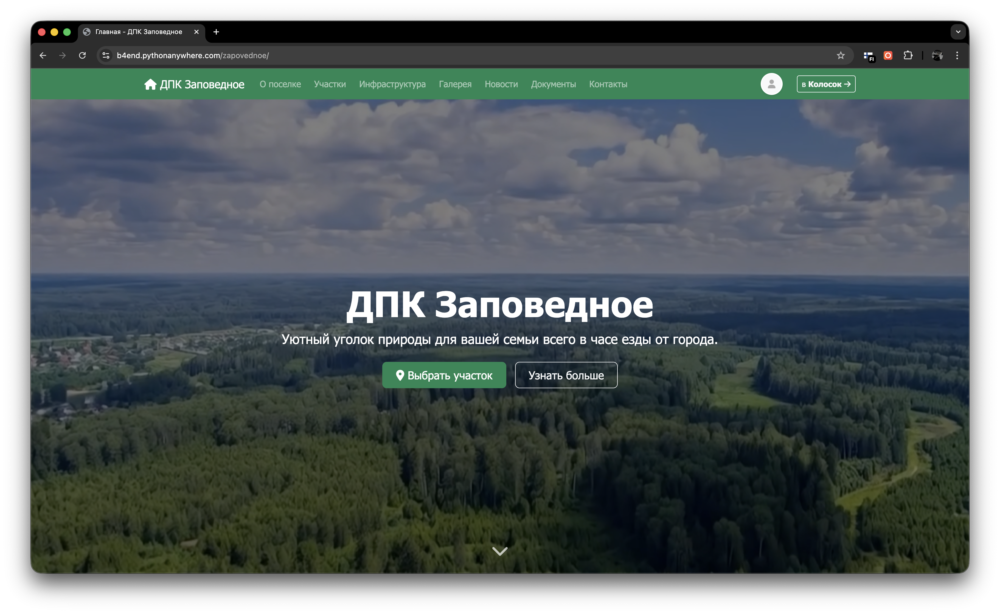
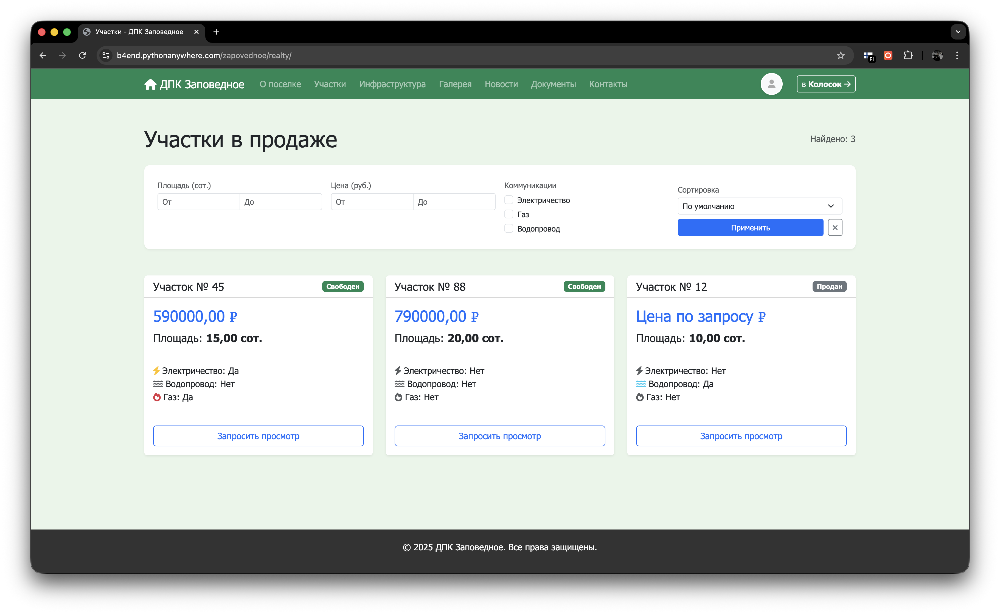
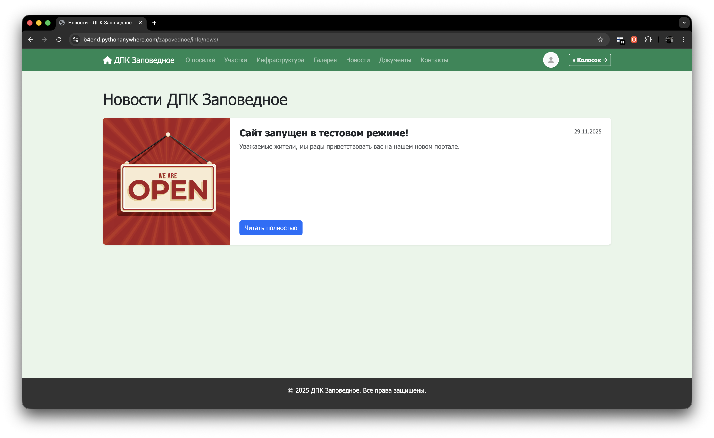
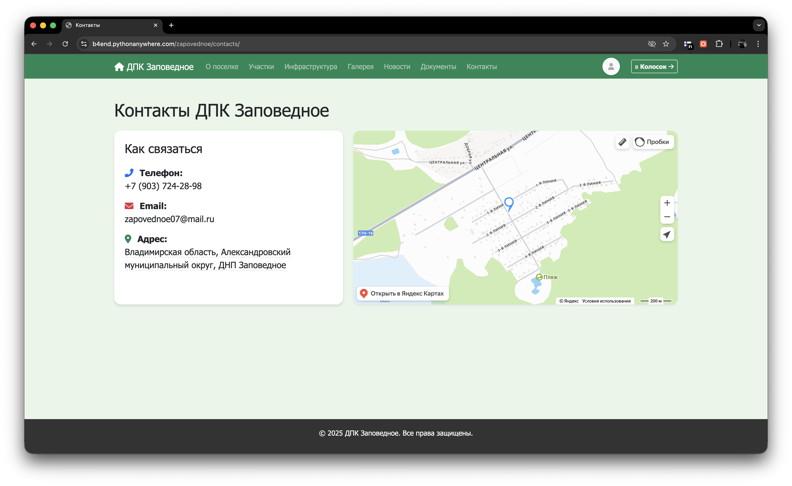

# 🏡 Dacha Project: Платформа управления дачным поселком


Комплексная CMS на базе Django для управления жизнью коттеджного или дачного поселка (ДНП / СНТ). Позволяет вести реестр участков, публиковать новости, делиться документами с жителями и управлять инфраструктурой. 

🌐 **Демонстрация:**[Сайт ДПК "Заповедное"](https://b4end.pythonanywhere.com/zapovednoe)

## 📸 Скриншоты

*Добавьте сюда 2-3 скриншота вашего сайта (Главная страница, Каталог участков, Личный кабинет).*
* 
* 
* 
* 

## ✨ Ключевые возможности

* **Мультипоселковая архитектура (Multi-tenancy):** База данных спроектирована так, что на одном развернутом инстансе можно управлять сразу несколькими независимыми поселками.
* **Модуль "Недвижимость" (`realty`):** 
  * Интерактивный каталог участков с указанием площади, цены и наличия коммуникаций (Газ, Вода, Электричество).
  * Статусы участков: Свободен / Забронирован / Продан.
* **Модуль "Контент" (`content`):**
  * Публикация новостей и объявлений.
  * Файловое хранилище для документов (Уставы, протоколы собраний) с разделением прав доступа (публичные документы и только для авторизованных жителей).
  * Галерея фотографий поселка.
* **Система ролей (`core`):** Разграничение прав пользователей (Администратор, Председатель, Житель, Гость). Автоматическая генерация уникальных аватарок для пользователей.

## 🛠 Технологический стек
* **Backend:** Python, Django 5.x
* **Database:** SQLite (оптимально для текущих нагрузок, легко масштабируется до PostgreSQL)
* **Frontend:** HTML/CSS (Django Templates)
* **Инструменты:** Pillow (обработка изображений)

## 🚀 Установка и локальный запуск

1. Склонируйте репозиторий:
   ```bash
   git clone https://github.com/b4end/dacha-project.git
   cd dacha-project
   ```

2. Создайте и активируйте виртуальное окружение:
   ```bash
   python -m venv venv
   source venv/bin/activate  # Для Windows: venv\Scripts\activate
   ```

3. Установите зависимости:
   ```bash
   pip install -r requirements.txt
   ```

4. Примените миграции базы данных:
   ```bash
   python manage.py migrate
   ```

5. Создайте суперпользователя для доступа в админку:
   ```bash
   python manage.py createsuperuser
   ```

6. Запустите сервер для разработки:
   ```bash
   python manage.py runserver
   ```
Сайт будет доступен по адресу `http://127.0.0.1:8000`. Панель администратора — `http://127.0.0.1:8000/admin`.

## 📦 Деплой (на примере PythonAnywhere)

Проект легко разворачивается на хостинге PythonAnywhere с помощью простого `git pull`:
1. Клонируете репозиторий в консоли PythonAnywhere.
2. Создаете Virtualenv и устанавливаете зависимости.
3. В настройках Web App указываете путь к `dacha_project/wsgi.py`.
4. Настраиваете раздачу статики (Static Files) для папок `/static/` и `/media/`.

## 📂 Структура проекта
* `core/` — Ядро проекта: расширенная модель пользователя, модель поселка, аутентификация.
* `content/` — Информационные блоки: новости, документы, статические страницы (О поселке, Инфраструктура), галерея.
* `realty/` — Бизнес-логика продаж: участки, цены, статусы, коммуникации.